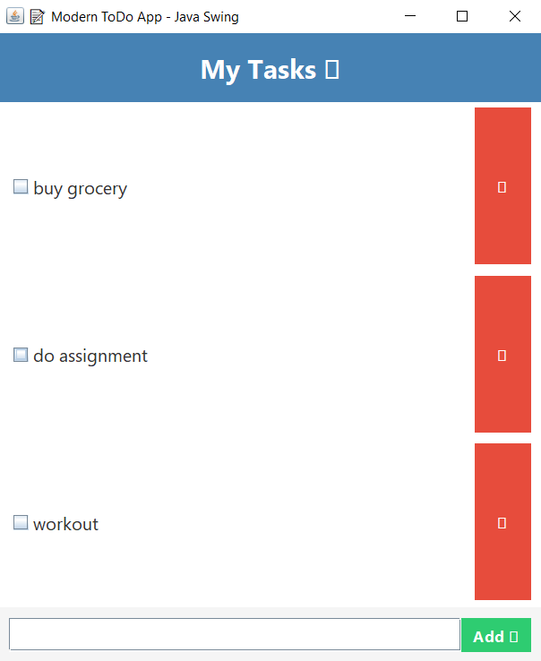

# 📝 Java GUI ToDo App

## 📌 Task 6: Java GUI – ToDo App (Swing-based Desktop Application)

### 🎯 Objective:
Build a simple yet interactive **To-Do List Manager** using **Java Swing GUI components**.

---

## 💻 Project Description:

This project implements a **Java Swing-based ToDo App** that allows users to:

✅ Add new tasks  
✅ Mark tasks as completed  
✅ Delete selected tasks  
✅ View all tasks in a modern styled list  

The app demonstrates **event-driven programming**, **GUI design with layouts**, and **basic data structure management (using ArrayList)**.

---

## 📂 Folder Structure:
Java GUI ToDo App/
├── Task.java
├── ToDoApp.java
├── README.md
├── Output.txt

> ⚠️ Note: `.class` files are generated during compilation but not pushed to GitHub.

---

## 🧱 Key Java Concepts Used:

- **Java Swing GUI:** JFrame, JPanel, JButton, JTextField, JList, JScrollPane  
- **Event Handling:** ActionListener, ListSelectionListener  
- **Layout Management:** BorderLayout, FlowLayout  
- **Object-Oriented Programming:** Custom `Task` class  
- **Collections:** ArrayList  

---

## 🛠️ Tools & Technologies:

- Java (JDK 17)
- VS Code / IntelliJ IDEA / Eclipse
- Command Prompt / Terminal

---

## ✅ How to Run:

1. Open terminal in project folder:

javac Task.java ToDoApp.java
java ToDoApp

GUI Window will appear.

🎨 Features:
Feature	Description
➕ Add Task	Adds a new task to the list
✅ Mark Complete	Marks a selected task as done
❌ Delete Task	Deletes selected task from list
📝 View Tasks	Scrollable list of all tasks

---
📸 Sample GUI Screenshot:

---

📥 Sample Output / User Flow:
See Output.txt for a sample run interaction.
---

# ❓ Interview Questions:
What is Swing in Java?

Difference between AWT and Swing?

What is an ActionListener?

Explain Event Dispatch Thread (EDT).

What is Layout Manager?

Difference between JPanel and JFrame?

How to add scroll bars in Swing?

What is MVC architecture in Java GUI apps?

What is the role of repaint()?

Difference between setVisible(true) and pack()?
---
 # Outcome:
Hands-on with Java GUI development

Practiced Swing layouts, events, and component handling

Learned event-driven programming in Java

